

* TOC
{:toc}

This guide describes how to import application source files, build, run and debug application using [Eclipse](https://www.eclipse.org) IDE.

If you want to build on OS X (macOS), your Eclipse application must be executed under current user from shell.

>**NOTE:**
>Eclipse version 4.6.0 was used to verify the information below.
{:.note}

## Import source files

1. Open Eclipse and start a new project.
	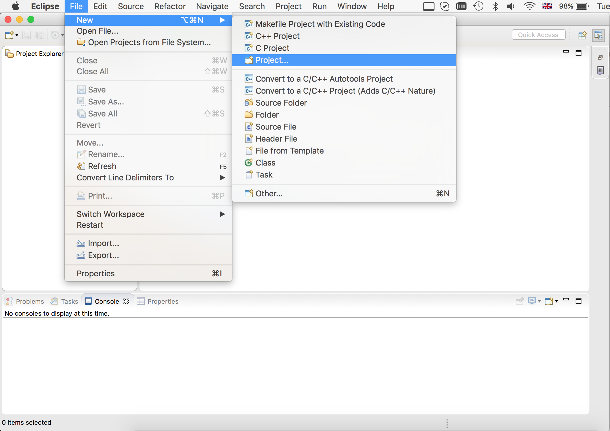
	
2. Select **C Project**, **C++ Project**, or **Java Project**.
	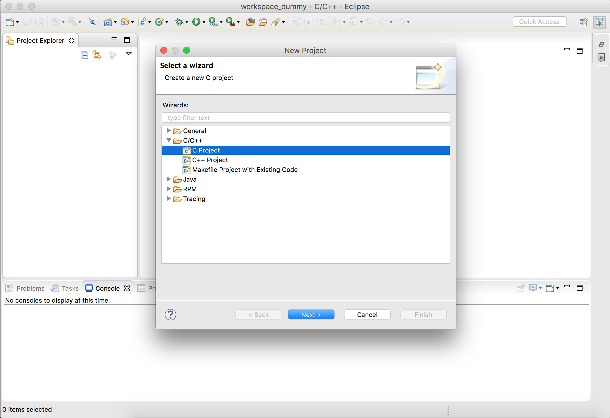
	
3. Enter your project name.  
Clear the **Use default location** check box and enter the path to the directory containing the source files (or click **Browse...** to navigate to it).  
In the **Project type** section, select **Executable** > **Empty project** and pick any toolchain.  
Click **Next**.
	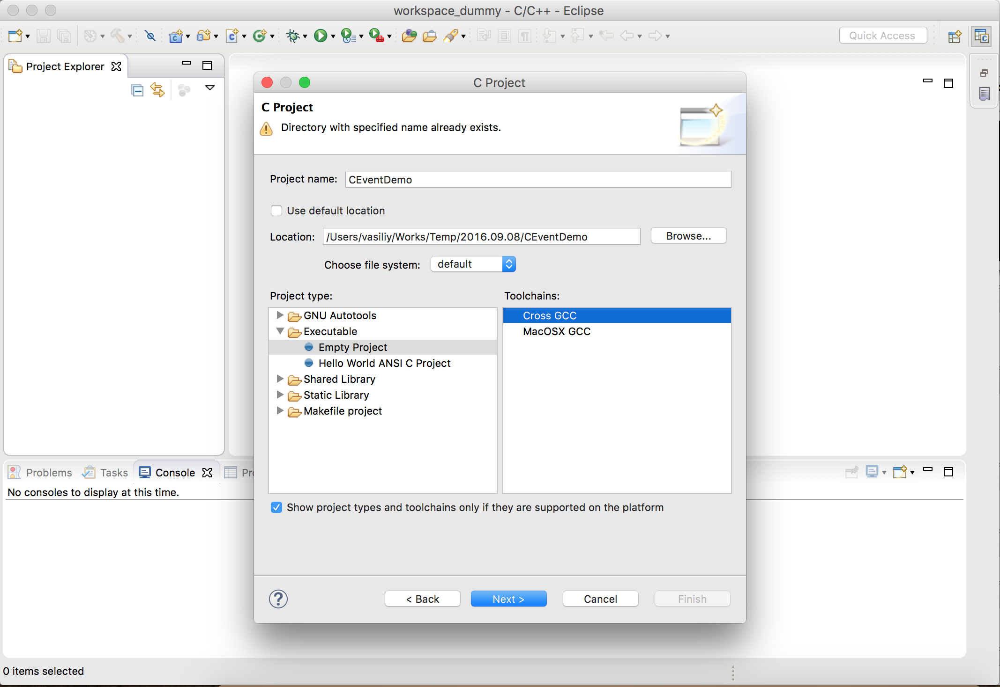
	
5. Make sure you have all configurations selected and click **Next**.
	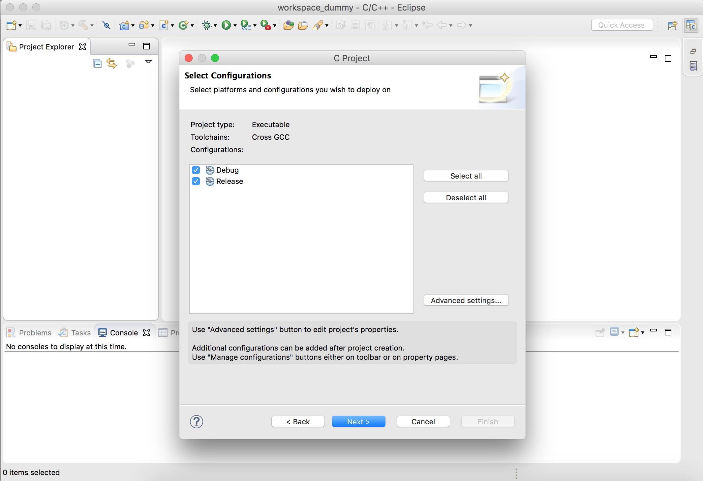
	
6. In the **Gross GCC Command** window, leave the fields blank and click **Finish**.
	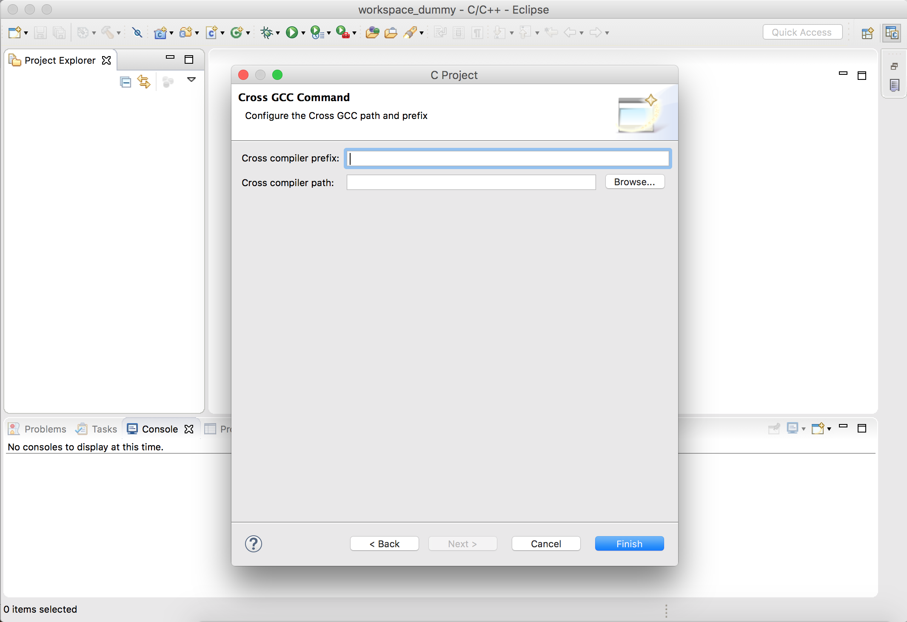
	
Your new project is now accessible from the **Project Explorer**.
	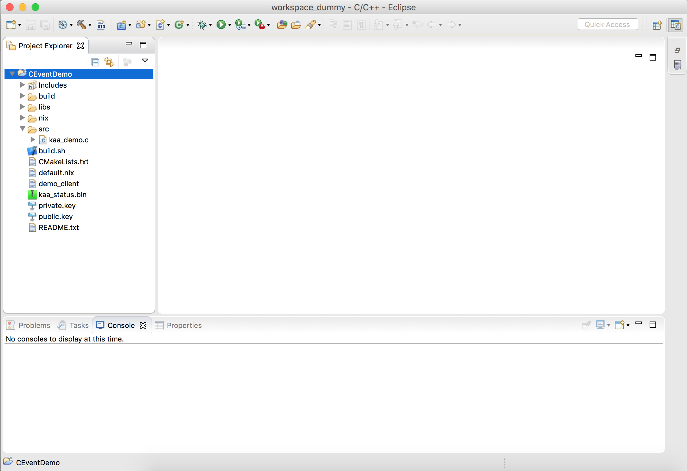

## Build configuration

1. Open the **Project** menu and select **Properties**.
	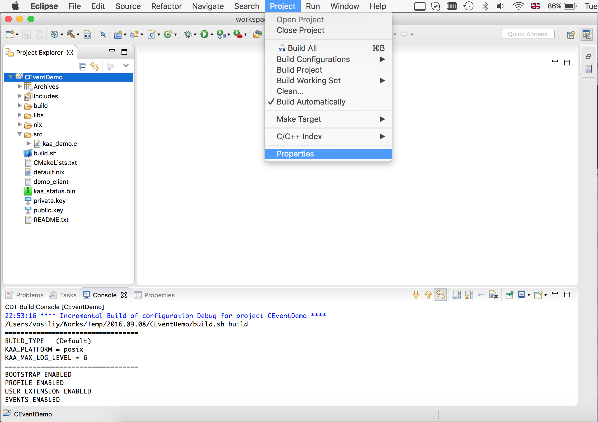
	
2. In the project properties window, click **C/C++ Build** and select the required configuration: **Debug** or **Release**.  
In the **Builder Settings** tab, clear the **Use default build command** and **Generate Makefiles automatically** check boxes.  
In the **Build command** field, type **${workspace_loc:/\<Project name\>}/build.sh**
	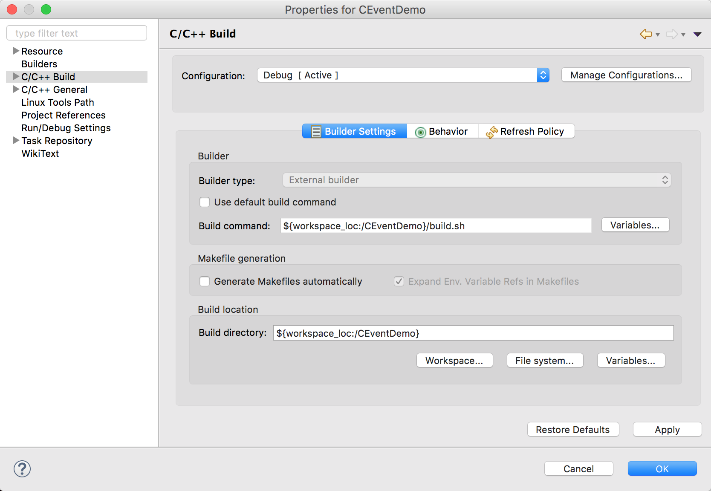
	
3. In the **Behavior** tab, select all check boxes and enter the values in the **Make build target** fields as shown below.  
Click **OK**.
	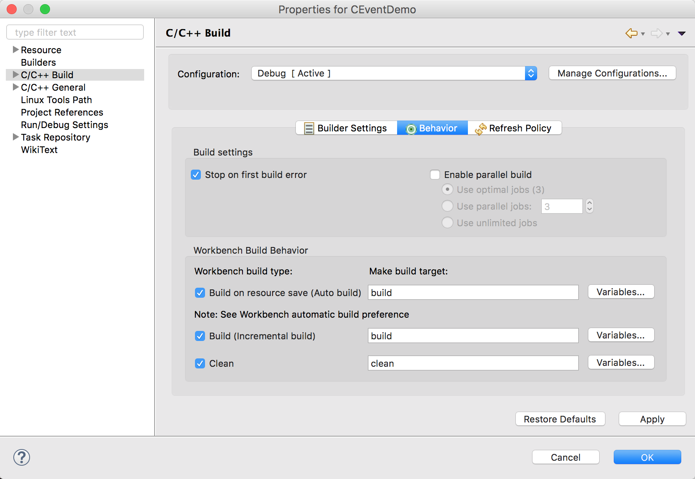
	
Your can access your build log from the **Console** window.

## Set up run target

1. Open the **Run** menu and select **Run Configurations...**
	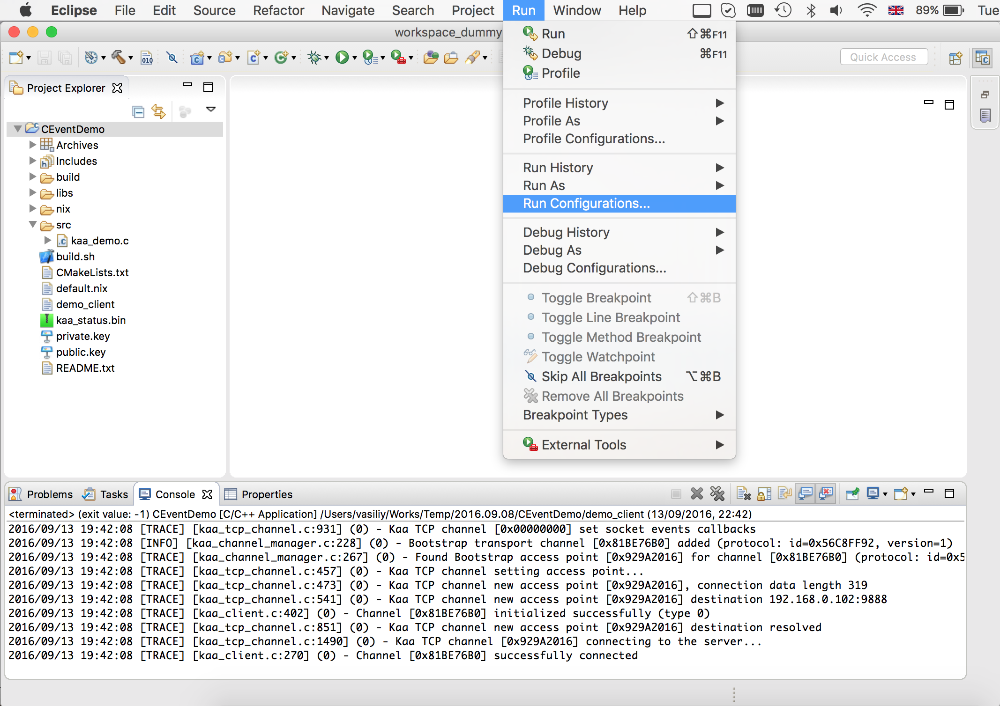
	
2. In the configurations window, select **C/C++ Application** or **Java Application**.  
Click the **New** button to create a configuration.
	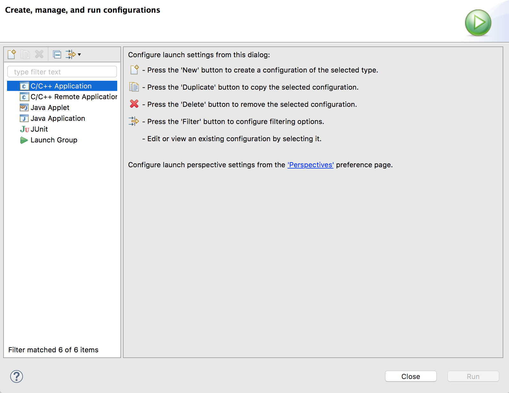
	
3. In the new configuration window, enter the project name, path to the C/C++ application, and click **Run**.
	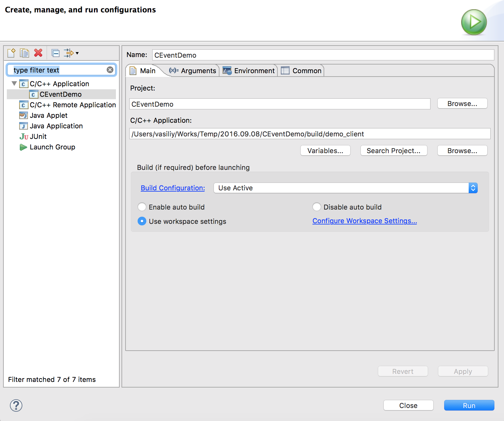
	
You can acess your application output from the **Console** window.

## Set up debug target

> **NOTE:** If you use OS X (macOS):  
>First install the "gdb-apple" debugger from [Macports](https://www.macports.org/install.php) and add a code sign certificate for it.
>See [OS X (macOS) instructions]({{root_url}}Importing-application-into-IDE-guide/Eclipse/#os-x-macos-instructions).  
>If your run target is already set up, only perform step 4.
{:.note}

1. Open the **Run** menu and select **Debug Configurations...**

2. In the configurations window, select **C/C++ Application** or **Java Application**.  
Click the **New** button to create a configuration.

3. In the new configuration window, enter the project name, path to the C/C++ application.
	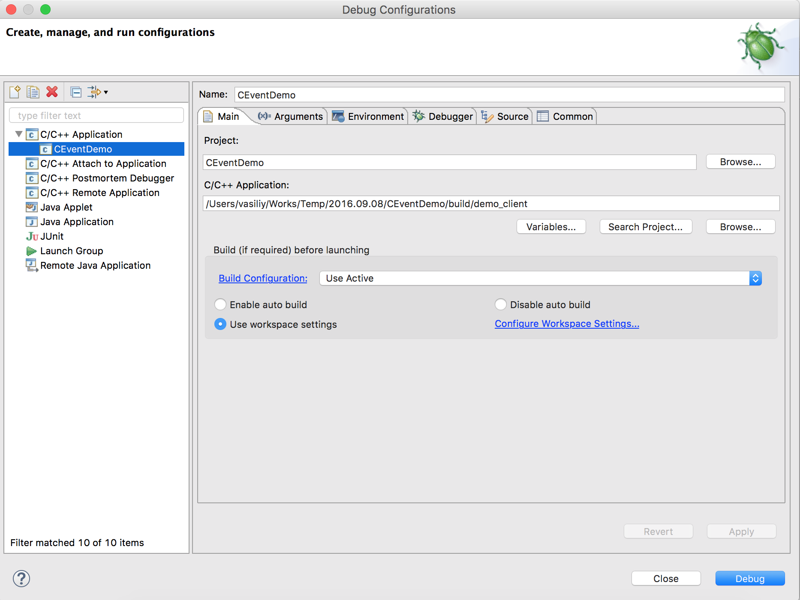

4. In the **Debugger** tab, set the **GDB debugger** field to **gdb-apple** and click **Debug**.
	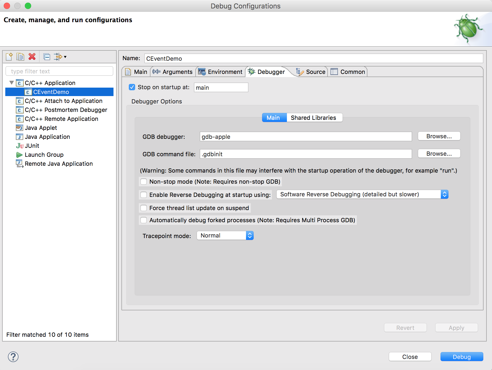
	
The IDE is now switched to the "Debug" mode and you can start debugging your application.

## OS X (macOS) instructions

If you make a build using OS X (macOS):

* Install [Macports](https://www.macports.org/install.php).
* Install the "gdb-apple" package.

		sudo port install gdb-apple
		
After you installed the "gdb-apple" package, manage its code signing certificate:

1. Launch /Applications/Utilities/Keychain Access.app

2. In the **Keychain Access** window, select the **login** keychain from the **Keychains** list.

3. Click **Certificate Assistant** > **Create a Certificate...** and make the following settings.
	
		Name = gdb-apple_codesign
		Identity Type = Self Signed Root
		Certificate Type = Code Signing

4. Click **Continue** on the next two windows, then click **Done**.

5. Click **My Certificates** and double click on your new "gdb-apple_codesign" certificate.

6. Turn down the "Trust" disclosure triangle and set **When using this certificate** to **Always Trust**.

7. Enter your login and password to confirm and make it trusted.

8. Drag the copy of "gdb-apple_codesign" certificate you just created and drop it onto your desktop.

9. Run the following comand.

		sudo security add-trust -d -r trustRoot -p basic -p codeSign -k /Library/Keychains/System.keychain ~/Desktop/gdb-apple_codesign.cer

10. Delete gdb-apple_codesign.cer from the desktop and restart your machine.

## Using CMake tools to generate project

To use CMake tools to generate a project, you need to have the following software installed:

* Eclipse version 4.6 and newer.
* CMake version 3.0.2 and newer.

After you installed the above software:

1. Unpack demo source.

2. Run the following command from shell.

		cmake -G"Eclipse CDT4 - Unix Makefiles" -DCMAKE_BUILD_TYPE=Debug -D_ECLIPSE_VERSION=4.6 <Path to source files>

3. Click **File** > **Import** to import the project.

4. Select **General** > **Existing projects into workspace**.

5. Navigate to your build tree and select the root directory.
Make sure the **Copy projects into workspace** check box is clear.

To build a project, click **Project** > **Build Project**.

See also [Eclipse CDT4 Generator](https://cmake.org/Wiki/Eclipse_CDT4_Generator).
