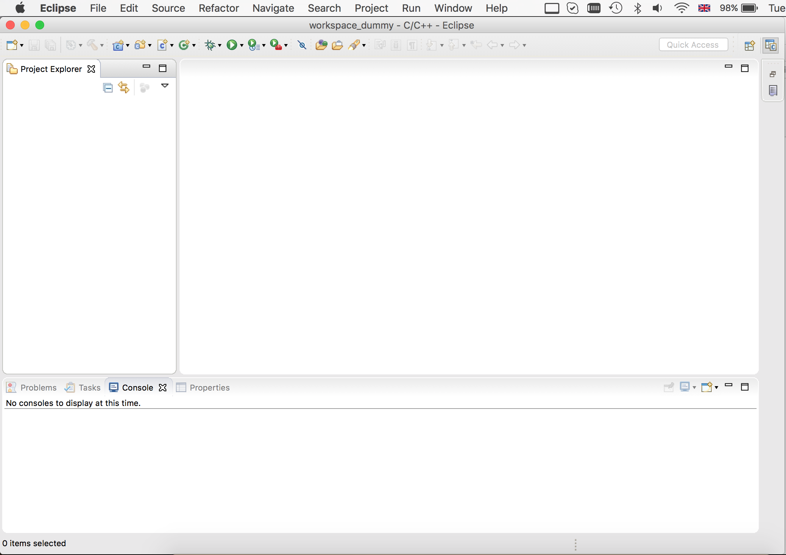
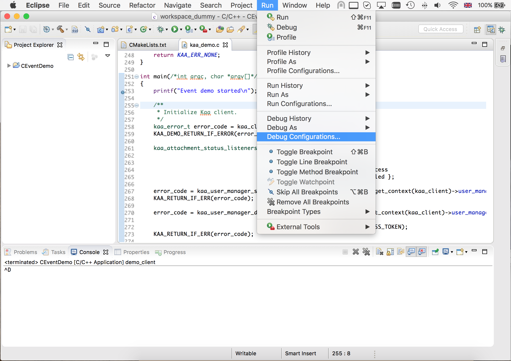
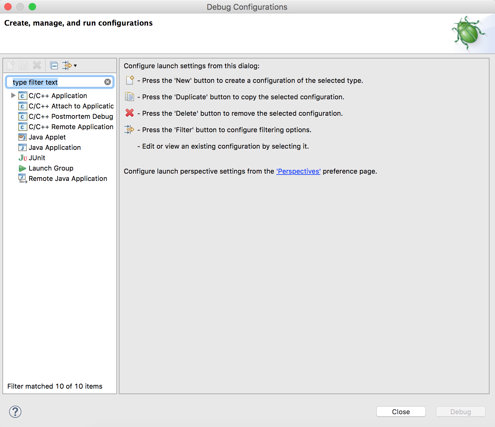

This guide describes how to import application source files, build, run and debug application using [Eclipse](https://www.eclipse.org) IDE. 

* TOC
{:toc}

## Import source files

1. Open Eclipse

2. From menu bar “File -> New -> Project…”

3. In opened dialog select “C Project”, “C++ Project” or “Java Project”

4. Remove check from “Use default location” and enter path to the demo source (or navigate to it using dialog “Browse...”)
5. In next window enter “Project name:” <Demo name> (in example is "CEventDemo")
6. Select “Executable -> Empty Project”. Toolchain does not matter.

7. Click “Next”, than “Next” and “Finish”
 
8. Now you can explore new project at “Project Explorer”


## Link build system

1. From menu bar “Project -> Properties”

2. Go to "C/C++ Build" settings
3. Select required configuration (Debug or Release)
4. Open "Builder settings" tab 
5. Remove checks from "Use default build command" and "Generate Makefiles automatically"
6. Set "Build command" to "${workspace_loc:/\<Project name\>}/build.sh" (in example is "CEventDemo")

7. Go to "Behaviour" tab
8. Set check on "Build on resource save (Auto build)" and set command to "build"
9. Set check on "Build (Incremental build) and set command to "build"
10. Set check on "Clean" and set command to "clean" 
11. Press "Ok"

12. Now you can explore build log in "Console" window


## Setup run target

1. From menu bar “Run -> Run Configurations...”

2. Select "C/C++ Application" or "Java Application"
3. Press "New" button to create new configuration

4. Enter "Project" name (in example is "CEventDemo")
5. Enter path to "C/C++ Application"
6. Press "Run" button

7. Now you can explore application output in "Console" window


## Setup debug target
  
1. From menu bar “Run -> Debug Configurations...”

2. Select "C/C++ Application" or "Java Application"
3. Press "New" button to create new configuration

4. Enter "Project" name (in example is "CEventDemo")
5. Enter path to "C/C++ Application"

6. Go to "Debugger" tab
7. Set "GDB debugger" to "gdb-apple" 
8. Press "Debug" button

9. Now IDE will switch to "Debug" mode and you can start debug application

**Notes:** 

* If "run target was setup before start from step #6
* Steps 7 and 8 are suitable only for OS X (macOS)
* Before start setup target on OS X (macOS) you have to install "gdb-apple" from macports and add code sign certificate for "gdb-apple" debugger, see bellow instructions for these steps


## Useful notes for OS X (macOS)

### Install "gdb-apple" on OS X (macOS)

* Install [Macports](https://www.macports.org/install.php)
* Install "gdb-apple" package:

    ```
    sudo port install gdb-apple
    ```


### Codesign of "gdb-apple"

* Launch /Applications/Utilities/Keychain Access.app
* In Keychain Access select the "login" keychain in the "Keychains" list in the upper left hand corner of the window
* Select the following menu item: "Keychain Access->Certificate Assistant->Create a Certificate..."
* Set the following settings
    Name = gdb-apple_codesign
    Identity Type = Self Signed Root
    Certificate Type = Code Signing
* Click Continue
* Click Continue
* Click Done
* Click on the "My Certificates"
* Double click on your new "gdb-apple_codesign" certificate
* Turn down the "Trust" disclosure triangle
    Change:
        When using this certificate: Always Trust
* Enter your login password to confirm and make it trusted
* Drag the copy of "gdb-apple_codesign" you just made there onto the desktop.
* Switch to Terminal, and run the following:

    ```
    sudo security add-trust -d -r trustRoot -p basic -p codeSign -k /Library/Keychains/System.keychain ~/Desktop/gdb-apple_codesign.cer
    ```

* Delete "gdb-apple_codesign.cer" from desktop
* Reboot


## Notes 

* To build properly on OS X (macOS), Eclipse application must be executed under current user from shell
* Eclipse version used in instructions


## Using "cmake" tools to generate project

**Requirements:**

* Eclipse 4.6+
* CMake 2.8.8+

**Process:**

1. Unpack demo source
2. Execute from shell

    ``` 
    cmake -G"Eclipse CDT4 - Unix Makefiles" -DCMAKE_BUILD_TYPE=Debug -D_ECLIPSE_VERSION=4.6 <Path to source files>
    ```

3. Import project from menu bar "File- > Import"
4. Select "General -> Existing projects into workspace":
5. Browse where your build tree is and select the root build tree directory. Keep "Copy projects into workspace" unchecked.
6. You get a fully functional eclipse project
7. Unfortunately **Build** button is not available, but you can build from menu bar "Project -> Build Project"

**Documentation:**

* [Eclipse CDT4 Generator](https://cmake.org/Wiki/Eclipse_CDT4_Generator)

